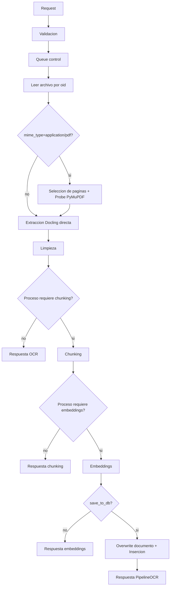

# OCR Chunking Embedding - Guia rapida

Servicio OpenAPI para procesar documentos (OCR, chunking y embeddings) desde un `oid`.

## Idea clave

- `oid` es el identificador principal del proceso (LOID del archivo).
- El `documento_id` real se resuelve internamente en `GestorDocumental.Documentos` por `metadatosExtra.ocr.metadata.oid` y fallback por `archivoNombre`.
- Si se envia `nombre_documento`, no se consulta el nombre en `ItemsIngestaSmb` por OID.
- Al terminar OCR+limpieza, el servicio actualiza `GestorDocumental.Documentos.contenidoTexto`.
- Se valida `mime_type` (ejemplo: `application/pdf`) contra formatos soportados por Docling (sin audio/video).
- El response incluye `ocr_quality` y `ocr_confidence` (sin detalle pagina a pagina).

MIME soportados: PDF, DOCX/XLSX/PPTX, Markdown, AsciiDoc, LaTeX, HTML/XHTML, CSV e imagenes PNG/JPEG/TIFF/BMP/WEBP.

## Endpoints por proceso

- `POST /ocr-docling/process`
- `POST /ocr-docling/process-batch`
- `POST /chunking-docling/process`
- `POST /chunking-docling/process-batch`
- `POST /embedding-generation/process`
- `POST /embedding-generation/process-batch`
- `POST /PipelineOCR/process`
- `POST /PipelineOCR/process-batch`
- `GET /health`
- `GET /example-request`

## Autenticacion obligatoria

El servicio ahora exige token para acceder a los endpoints (excepto login):

- `POST /auth/login` (recibe `username` y `password`).
- Header requerido en las demas rutas:
  - `Authorization: Bearer <token>` **o**
  - `X-API-Token: <token>`

Variables de entorno:

- `OCR_AUTH_ENABLED` (default `true`)
- `OCR_AUTH_USER` (default `admin`)
- `OCR_AUTH_PASSWORD` (default `admin`)
- `OCR_FIXED_TOKEN` (default `CAMBIAR_TOKEN_OBLIGATORIO`)

## Flujo interno



## Parametros minimos

```json
{
  "input": {
    "oid": 2299268
  }
}
```

## Parametros recomendados

```json
{
  "input": {
    "oid": 2299268,
    "nombre_documento": "CTO_EyP_LLA_50_2013.pdf",
    "mime_type": "application/pdf",
    "job_filde_id": 4567,
    "usuario_proceso": "analista_anh",
    "job_proceso": "JOB_OCR_20260309_001",
    "created_by": 1101,
    "metadata": {
      "nombre_documento": "CTO_EyP_LLA_50_2013.pdf",
      "metadata_documento": {"paginas": 133, "idioma": "es"},
      "ruta_pdf": "\\\\servidor\\share\\CTO_EyP_LLA_50_2013.pdf"
    },
    "overwrite": {
      "enabled": false,
      "allow_duplicate_hash": false,
      "allow_reprocess_processed": false
    }
  }
}
```

## Ejemplo por metodo

### OCR

Request minimo:

```json
{"input": {"oid": 2299268}}
```

Retorno esperado (resumen):

```json
{"status":"COMPLETED","exitoso":true,"data":{"stage":"ocr","engine_used":"pymupdf","ocr_text_chars":12345}}
```

### Chunking

Request minimo:

```json
{"input": {"oid": 2299268, "chunking": {"strategy": "semantic"}}}
```

Retorno esperado (resumen):

```json
{"status":"COMPLETED","exitoso":true,"data":{"stage":"chunking","chunks_count":32}}
```

### Embeddings

Request minimo:

```json
{"input": {"oid": 2299268, "embedding": {"enabled": true, "save_to_db": false}}}
```

Retorno esperado (resumen):

```json
{"status":"COMPLETED","exitoso":true,"data":{"stage":"embedding","chunks_count":32}}
```

### PipelineOCR (todo el proceso)

Request minimo para guardar embeddings:

```json
{"input": {"oid": 2299268, "created_by": 1101}}
```

Retorno esperado (resumen):

```json
{"status":"COMPLETED","exitoso":true,"data":{"stage":"pipeline","oid_documento":2299268,"documento_id_resuelto":8123,"inserted_rows":32}}
```

## Estados y errores

- `status`: `COMPLETED`, `ENQUEUED`, `FAILED`.
- Si una solicitud falla, la API responde HTTP `403` con detalle completo (`phase`, `code`, `traceback`, `phases`).
- Errores comunes:
  - `OID_READ_FAILED`
  - `EMPTY_BINARY`
  - `QUEUE_BUSY`
  - `DUPLICATE_EMBEDDINGS`
  - `EMPTY_EXTRACTED_TEXT`
  - `EMPTY_CHUNKS`

## Ejecucion local

```powershell
python testProcesamientoOCR-Embedding\ocr_chunking.py --host 0.0.0.0 --port 8080
```

- Swagger: `http://127.0.0.1:8080/docs`
- ReDoc: `http://127.0.0.1:8080/redoc`

## Documentacion de parametros

Ver `funcionalidades_parametro.md`.

