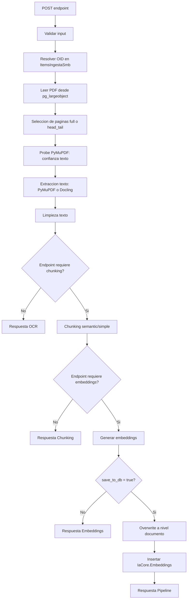

# OCR Chunking Embedding - Guia rapida

Servicio OpenAPI para procesar PDFs almacenados como Large Object en PostgreSQL.

## Que hace el servicio

`ocr_chunking.py` implementa un orquestador con 4 rutas funcionales:

1. `ocr-docling`: OCR + limpieza.
2. `chunking-docling`: OCR + limpieza + chunking.
3. `embedding-generation`: OCR + limpieza + chunking + embeddings.
4. `PipelineOCR`: flujo completo (incluye persistencia en `IaCore.Embeddings`).

El servicio usa cola (`Operaciones.ColasProcesamiento`) para controlar concurrencia y genera trazabilidad por fases en `Operaciones.JobsProcesamiento`.

## Flujo general



## Endpoints

### 1) OCR Docling

- `POST /ocr-docling/process`
- `POST /ocr-docling/process-batch`

Minimo:

```json
{
  "input": {
    "oid": 2299268
  }
}
```

Retorno esperado (resumen):

```json
{
  "status": "COMPLETED",
  "exitoso": true,
  "data": {
    "stage": "ocr",
    "engine_used": "pymupdf",
    "ocr_text_chars": 12345
  }
}
```

### 2) Chunking Docling

- `POST /chunking-docling/process`
- `POST /chunking-docling/process-batch`

Minimo:

```json
{
  "input": {
    "oid": 2299268,
    "chunking": { "strategy": "semantic" }
  }
}
```

Retorno esperado (resumen):

```json
{
  "status": "COMPLETED",
  "exitoso": true,
  "data": {
    "stage": "chunking",
    "chunks_count": 32,
    "chunks_preview": ["..."]
  }
}
```

### 3) Embedding Generation

- `POST /embedding-generation/process`
- `POST /embedding-generation/process-batch`

Minimo:

```json
{
  "input": {
    "oid": 2299268,
    "embedding": { "enabled": true, "save_to_db": false }
  }
}
```

Retorno esperado (resumen):

```json
{
  "status": "COMPLETED",
  "exitoso": true,
  "data": {
    "stage": "embedding",
    "chunks_count": 32,
    "inserted_rows": 0
  }
}
```

### 4) PipelineOCR (todo el proceso)

- `POST /PipelineOCR/process`
- `POST /PipelineOCR/process-batch`

Minimo para persistir:

```json
{
  "input": {
    "oid": 2299268,
    "documento_id": 7788
  }
}
```

Retorno esperado (resumen):

```json
{
  "status": "COMPLETED",
  "exitoso": true,
  "data": {
    "stage": "pipeline",
    "documento_id": 7788,
    "chunks_count": 32,
    "inserted_rows": 32
  }
}
```

## Endpoints auxiliares

- `GET /health`
- `GET /example-request`

## Parametros minimos / medios / completos

- Minimo tecnico: `oid`.
- Minimo para guardar embeddings: `oid + documento_id`.
- Medio recomendado: `oid + documento_id + metadata + queue.max_concurrency`.
- Completo: ajustar `extraction`, `cleaning`, `chunking`, `embedding`, `overwrite`, `queue`.

## Errores comunes

- `OID_NOT_FOUND`: el `oid` no existe en `ItemsIngestaSmb`.
- `QUEUE_BUSY`: cola llena y `queue_when_busy=false`.
- `DOCUMENTO_ID_REQUIRED`: se quiere guardar en BD sin `documento_id`.
- `DUPLICATE_EMBEDDINGS`: existen embeddings y `overwrite.enabled=false`.
- `EMPTY_EXTRACTED_TEXT`: OCR/extraccion sin contenido.

## Ejecucion local

```powershell
python testProcesamientoOCR-Embedding\ocr_chunking.py --host 0.0.0.0 --port 8080
```

Documentacion interactiva:

- `http://127.0.0.1:8080/docs`
- `http://127.0.0.1:8080/redoc`

## Pruebas mock

```powershell
python testProcesamientoOCR-Embedding\test_mock_ocr_chunking.py
```

Ver detalle funcional de parametros en `funcionalidades_parametro.md`.
